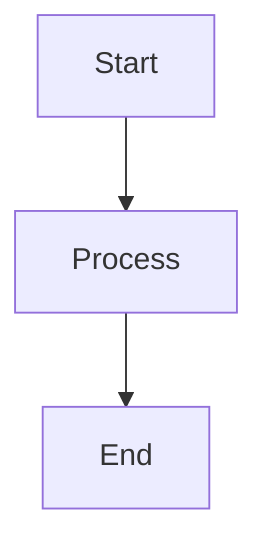
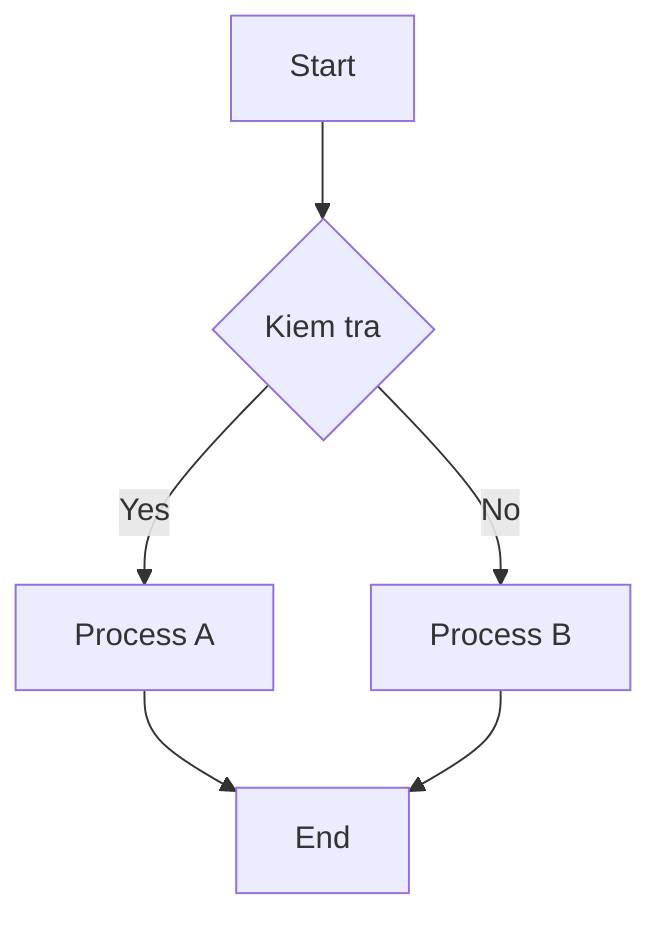
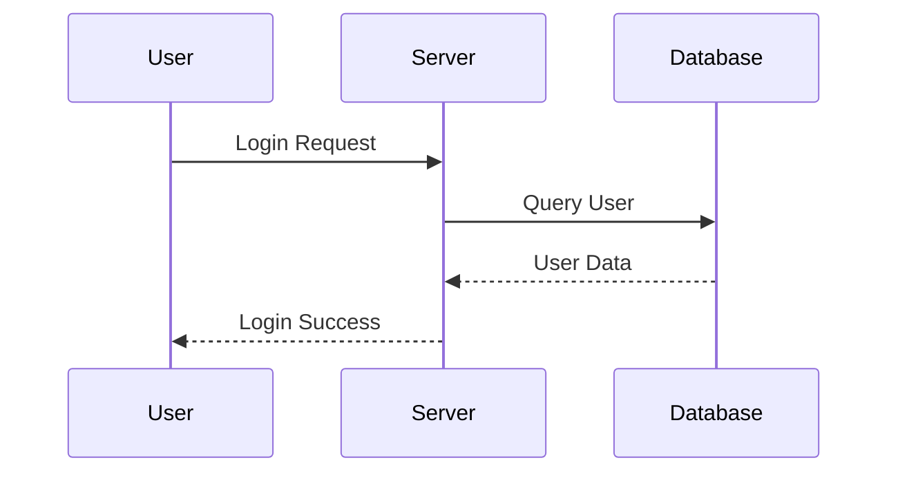

# Huong Dan Su Dung Mermaid Diagrams

Security Automation Toolkit co the chuyen Mermaid diagram trong Markdown sang hinh anh trong file Word.

## Cach Viet Diagram

Dat Mermaid code trong code block co ngon ngu `mermaid`:

````markdown

````

## Chuyen Sang Word

```bash
python toolkit.py md2word samples/mermaid_sample.md
```

Chi dinh file dau ra:

```bash
python toolkit.py md2word samples/mermaid_sample.md -o output/diagram.docx
```

## Cach Render

Cong cu se thu theo thu tu:

1. Render bang Mermaid CLI (`mmdc`) neu may da cai.
2. Render bang Mermaid Ink online API neu co internet.
3. Neu khong render duoc, nhung source Mermaid vao Word kem link `mermaid.live`.

## Cai Mermaid CLI

Can Node.js va npm, sau do chay:

```bash
npm install -g @mermaid-js/mermaid-cli
```

Kiem tra:

```bash
mmdc --version
```

## Vi Du Flowchart



## Vi Du Sequence Diagram



## Luu Y

- Diagram phai nam trong code block `mermaid`.
- Neu Word file dang mo, viec luu file dau ra co the that bai.
- Mermaid Ink can internet. Neu khong co internet, hay cai Mermaid CLI de render offline.
