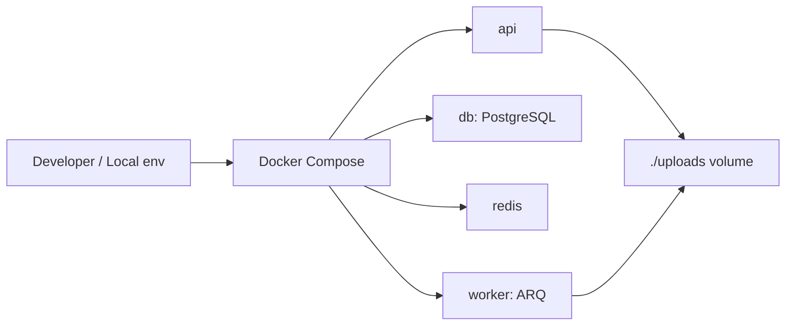
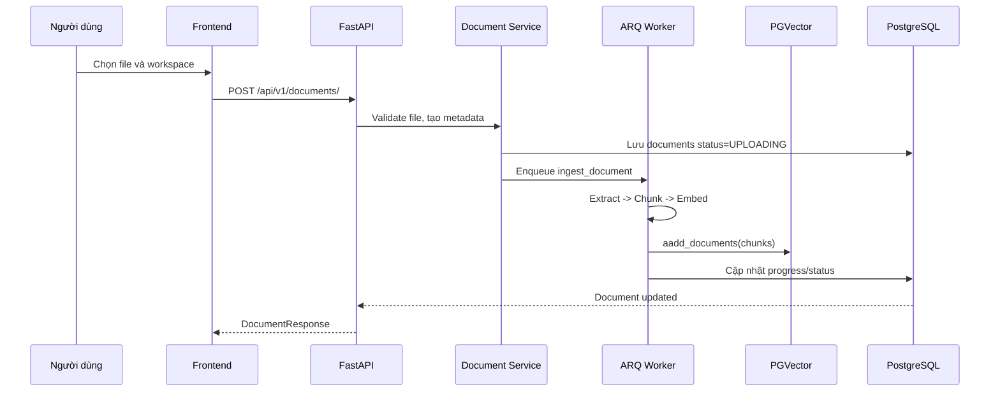
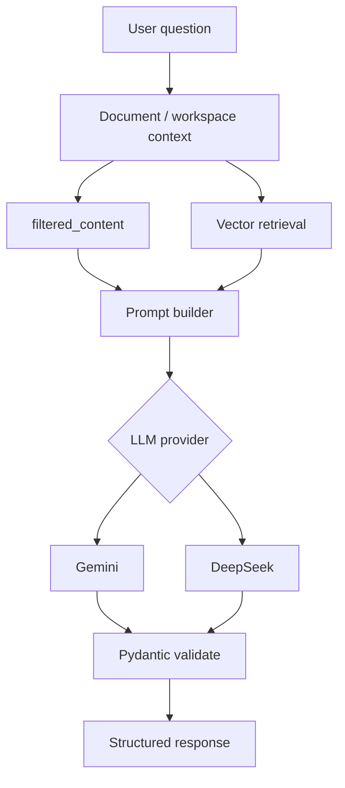
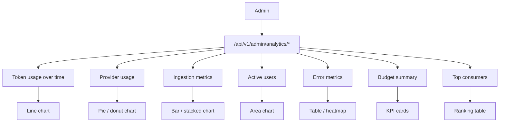

# Phụ Lục Biểu Đồ NCKH

Tài liệu này bổ sung các biểu đồ trực quan để dùng kèm báo cáo kỹ thuật chính. Nội dung được trích theo source code hiện tại của dự án.

## 1. Bản Đồ API Tổng Hợp

```mermaid
mindmap
  root((API))
    Auth
      GET /api/v1/auth/me
    Users
      GET /api/v1/users/profile
      POST /api/v1/users/sync
      POST /api/v1/users/avatar
      PUT /api/v1/users/profile
      GET /api/v1/users/gpa
      POST /api/v1/users/gpa
    Workspaces
      GET /api/v1/workspaces/
      POST /api/v1/workspaces/
      DELETE /api/v1/workspaces/{workspace_id}
    Documents
      POST /api/v1/documents/
      GET /api/v1/documents/
      GET /api/v1/documents/{doc_id}
      GET /api/v1/documents/{doc_id}/status
      DELETE /api/v1/documents/{doc_id}
    AI
      POST /api/v1/ai/summarize
      POST /api/v1/ai/summarize-multiple
      POST /api/v1/ai/generate-quiz
      POST /api/v1/ai/generate-mindmap
      POST /api/v1/ai/chat
      POST /api/v1/ai/explain
      POST /api/v1/ai/grade
      GET /api/v1/ai/chat/history
    Progress
      GET /api/v1/progress/
      POST /api/v1/progress/time
      DELETE /api/v1/progress/
    Roadmap
      POST /api/v1/roadmap/generate
      GET /api/v1/roadmap/list
      GET /api/v1/roadmap/timeline/list
      PUT /api/v1/roadmap/stage/{stage_id}/progress
    Analysis
      GET /api/v1/analysis/
    Admin
      GET /api/v1/admin/analytics/overview
      GET /api/v1/admin/analytics/overview/stream
      GET /api/v1/admin/analytics/tokens
      GET /api/v1/admin/analytics/providers
      GET /api/v1/admin/analytics/errors
      GET /api/v1/admin/analytics/users
      GET /api/v1/admin/analytics/ingestion
```

## 2. Kiến Trúc Triển Khai



## 3. Luồng Upload Và Ingestion



## 4. Pipeline AI RAG



## 5. Dashboard Analytics



## 6. Gợi Ý Dùng Trong NCKH

- Chèn biểu đồ API tổng hợp vào phần tổng quan hệ thống.
- Chèn biểu đồ upload-ingestion vào phần thiết kế backend.
- Chèn biểu đồ RAG vào phần pipeline AI.
- Chèn biểu đồ analytics vào phần giá trị vận hành và đánh giá hệ thống.

