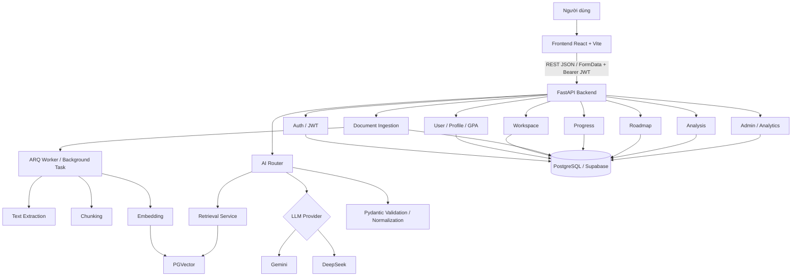
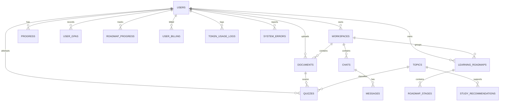
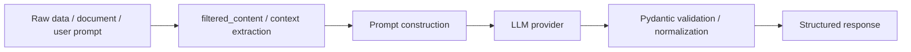

# Báo Cáo Kỹ Thuật Hệ Thống NCKH

## 1. Giới Thiệu Dự Án

Dựa trên source code hiện tại, dự án là một nền tảng học tập tích hợp AI với tên gọi nội bộ `AI Learning Assistant` hoặc `LearnOS`. Mục tiêu chính là cho phép người dùng tải tài liệu học tập, trích xuất và lập chỉ mục nội dung, sau đó khai thác tài liệu này thông qua các chức năng như tóm tắt, hỏi đáp ngữ cảnh, sinh quiz, tạo mindmap, tạo roadmap học tập và theo dõi tiến độ học tập.

### Bài toán hệ thống giải quyết

Hệ thống giải quyết đồng thời ba bài toán kỹ thuật:

1. Chuẩn hóa quá trình xử lý tài liệu đầu vào có định dạng khác nhau như PDF, TXT, MD, DOCX.
2. Tích hợp AI sinh nội dung theo ngữ cảnh nhưng vẫn kiểm soát được chất lượng đầu ra bằng schema validation, rate limit và cơ chế fallback.
3. Lưu trữ và truy xuất dữ liệu học tập theo người dùng, workspace và các thực thể nghiệp vụ như quiz, roadmap, progress, billing.

### Đối tượng sử dụng

- Sinh viên hoặc người học tự chủ.
- Giảng viên hoặc người hướng dẫn muốn theo dõi tiến độ và nội dung học.
- Quản trị viên hệ thống cần giám sát token usage, lỗi AI và ingestion pipeline.

### Mục tiêu hệ thống

- Tạo trải nghiệm học tập cá nhân hóa dựa trên tài liệu riêng của người dùng.
- Giảm rủi ro sai định dạng và hallucination của AI bằng lớp validation trung gian.
- Hỗ trợ vận hành thực tế qua logging, analytics, quota và triển khai bằng Docker.

### Giá trị thực tiễn và nghiên cứu

Hệ thống có giá trị thực tiễn ở chỗ biến tài liệu tĩnh thành một nền tảng học tập tương tác. Về mặt nghiên cứu, dự án là ví dụ điển hình của kiến trúc ứng dụng AI có kiểm soát, trong đó LLM không được gọi trực tiếp từ frontend mà đi qua các lớp service, retrieval, validation và quota enforcement.

---

## 2. Tổng Quan Kiến Trúc Hệ Thống

### Sơ đồ kiến trúc



### Mô tả từng thành phần

| Thành phần | Vai trò | Căn cứ trong code |
|---|---|---|
| Frontend | SPA gọi API, upload file, hiển thị dashboard và AI feature | `frontend/package.json` có `react`, `react-router-dom`, `@tanstack/react-query`, `@xyflow/react`, `recharts` |
| FastAPI backend | Cung cấp REST API, dependency injection, middleware, exception handler | [`backend/app/main.py`](../backend/app/main.py) |
| Auth layer | Xác thực JWT Supabase và kiểm tra role | [`backend/app/dependencies/auth.py`](../backend/app/dependencies/auth.py), [`backend/app/core/security.py`](../backend/app/core/security.py) |
| Document ingestion | Tải file, trích xuất văn bản, chunk, embedding, cập nhật tiến độ | [`backend/app/routers/documents.py`](../backend/app/routers/documents.py), [`backend/app/services/ingestion/ingestion_service.py`](../backend/app/services/ingestion/ingestion_service.py) |
| Vector store | Lưu embedding và truy xuất ngữ cảnh | [`backend/app/database/vectorstore.py`](../backend/app/database/vectorstore.py), [`backend/app/services/retrieval_service.py`](../backend/app/services/retrieval_service.py) |
| AI orchestration | Tóm tắt, chat, quiz, mindmap, explain, grade | [`backend/app/routers/ai.py`](../backend/app/routers/ai.py), [`backend/app/services/ai/ai_service.py`](../backend/app/services/ai/ai_service.py) |
| Database | Lưu thực thể nghiệp vụ, analytics, quota | Models và migrations trong `backend/app/models` và `backend/migrations/versions` |
| Background worker | Chạy ingestion bất đồng bộ qua Redis/ARQ | [`backend/app/workers/ingestion_worker.py`](../backend/app/workers/ingestion_worker.py), [`backend/docker-compose.yml`](../backend/docker-compose.yml) |

### Luồng dữ liệu tổng thể

1. Người dùng đăng nhập trên frontend và nhận JWT từ Supabase.
2. Frontend gửi request với header `Authorization: Bearer <token>` đến FastAPI.
3. Dependency `get_current_user` giải mã token, tra cứu người dùng trong bảng `users`, và từ chối nếu token hoặc trạng thái user không hợp lệ.
4. Với upload tài liệu, backend lưu file, tạo bản ghi `documents`, rồi đưa tác vụ ingestion vào ARQ worker hoặc `BackgroundTasks`.
5. Worker trích xuất văn bản, chia đoạn, sinh embedding và ghi vào vector store PGVector.
6. Khi người dùng gọi AI feature, service lấy ngữ cảnh từ vector search hoặc `filtered_content`, xây prompt, gọi LLM provider, rồi validate output bằng schema Pydantic.
7. Kết quả được trả về frontend và đồng thời có thể được ghi log usage, quota, progress hoặc analytics.

### Lý do chọn kiến trúc này

Kiến trúc hiện tại là một dạng **modular monolith** trên backend:

- Phù hợp với một hệ thống nghiên cứu hoặc sản phẩm giai đoạn đầu vì đơn giản hóa triển khai và bảo trì.
- Vẫn tách rõ router, service, model, schema, dependency và worker nên dễ mở rộng.
- Cho phép tích hợp AI và ingestion pipeline mà không làm phình to controller.
- Có thể chuyển từng mô-đun nặng sang worker hoặc service riêng trong tương lai mà không phá vỡ toàn bộ hệ thống.

---

## 3. Công Nghệ Sử Dụng

| Thành phần | Công nghệ | Phiên bản | Lý do chọn |
|---|---|---|---|
| Backend framework | FastAPI | `0.115.0` | Hỗ trợ async, dependency injection, OpenAPI tự sinh |
| ASGI server | Uvicorn | `0.30.6` | Phù hợp triển khai FastAPI |
| ORM | SQLAlchemy | `2.0.35` | ORM mạnh, async support, mapping rõ ràng |
| Migration | Alembic | `1.13.3` | Quản lý phiên bản schema |
| PostgreSQL driver | `psycopg` | `3.3.4` | Driver async hiện đại cho PostgreSQL |
| Vector extension | pgvector | `0.3.5` | Lưu và tìm kiếm embedding |
| Auth token | `python-jose` | `3.3.0` | Giải mã và xác thực JWT |
| Password hashing | bcrypt | `4.2.0` | Hash mật khẩu an toàn |
| Settings | `pydantic-settings` | `2.5.2` | Quản lý biến môi trường |
| AI SDK | `google-genai` | `2.3.0` | Tích hợp Gemini |
| AI orchestration | LangChain | không ghim | Xây chain, retriever, LLM abstraction |
| File parsing | PyMuPDF, pdfplumber, python-docx | không ghim / `0.11.4` / `1.1.2` | Trích xuất PDF, DOCX, TXT |
| Background jobs | ARQ, Redis | không ghim | Chạy ingestion bất đồng bộ |
| HTTP client | httpx | `0.28.1` | Gọi API ngoài, deepseek, summarize |
| Frontend | React, Vite, TypeScript | `18.3.1`, `5.4.1`, `5.5.3` | SPA hiện đại, build nhanh |
| Frontend data layer | React Query | `5.100.11` | Cache và quản lý trạng thái server |
| Frontend graph | React Flow / XYFlow | `12.10.2` | Hiển thị mindmap / roadmap graph |
| Visualization | Recharts, Mermaid | `3.8.1`, `11.14.0` | Dashboard và biểu đồ |
| Deploy container | Docker | - | Chuẩn hóa môi trường chạy |

### Nhận xét kỹ thuật

Trong `backend/requirements.txt`, dự án cho thấy mục tiêu xây một backend AI đầy đủ hơn là chỉ một REST API đơn giản. Sự xuất hiện đồng thời của `pgvector`, `langchain`, `redis`, `arq`, `google-genai` và `python-jose` cho thấy hệ thống cần xử lý cả ba lớp: lưu trữ, AI và bảo mật.

---

## 4. Thiết Kế Backend

### Cấu trúc thư mục và vai trò từng layer

```text
backend/app
├── api/             # Route AI V2 và các route bổ sung
├── core/            # config, security, exceptions, rate limit, logging
├── database/        # session, vectorstore
├── dependencies/    # get_current_user, AI dependencies
├── models/          # ORM entities
├── prompts/         # prompt templates
├── repositories/    # truy vấn tổng hợp / analytics
├── routers/         # HTTP endpoint
├── schemas/         # request/response validation bằng Pydantic
├── services/        # business logic
├── utils/           # file/text helpers
└── workers/         # worker xử lý ingestion nền
```

### Router/endpoint chính

| Method | Path | Chức năng | Ghi chú |
|---|---|---|---|
| `GET` | `/health` | Kiểm tra trạng thái hệ thống | Từ [`backend/app/main.py`](../backend/app/main.py) |
| `GET` | `/` | Thông tin root service | Trả tên ứng dụng, docs, health |
| `GET` | `/api/v1/auth/me` | Lấy thông tin user hiện tại | Dựa trên JWT Supabase |
| `GET` | `/api/v1/documents/` | Danh sách tài liệu theo workspace | Cần ownership |
| `POST` | `/api/v1/documents/` | Upload tài liệu | Hỗ trợ `pdf`, `txt`, `md`, `docx` |
| `GET` | `/api/v1/documents/{doc_id}` | Xem metadata tài liệu | Kiểm tra quyền sở hữu |
| `GET` | `/api/v1/documents/{doc_id}/status` | Theo dõi trạng thái ingestion | Trả tiến độ background job |
| `DELETE` | `/api/v1/documents/{doc_id}` | Xóa tài liệu | Xóa file và metadata |
| `GET` | `/api/v1/workspaces/` | Danh sách workspace | Chỉ lấy workspace của user |
| `POST` | `/api/v1/workspaces/` | Tạo workspace | Validate tên không rỗng |
| `DELETE` | `/api/v1/workspaces/{workspace_id}` | Xóa workspace | Kiểm tra ownership |
| `POST` | `/api/v1/ai/summarize` | Tóm tắt tài liệu | Có cache ở service |
| `POST` | `/api/v1/ai/summarize-multiple` | Tóm tắt nhiều tài liệu | Tổng hợp nội dung nhiều file |
| `POST` | `/api/v1/ai/generate-quiz` | Sinh quiz | Rate limit riêng |
| `POST` | `/api/v1/ai/generate-mindmap` | Sinh mindmap | Validate node/edge |
| `POST` | `/api/v1/ai/chat` | Hỏi đáp theo ngữ cảnh | Có rate limit |
| `POST` | `/api/v1/ai/explain` | Giải thích đoạn văn | Có thể dùng context từ document |
| `POST` | `/api/v1/ai/grade` | Chấm quiz | Trả feedback chi tiết |
| `GET` | `/api/v1/ai/chat/history` | Lấy lịch sử chat | Có thể lọc theo `document_id` |
| `GET` | `/api/v1/progress/` | Lấy tiến độ học | Theo user |
| `POST` | `/api/v1/progress/time` | Cộng thời gian học | Cập nhật thống kê |
| `POST` | `/api/v1/roadmap/generate` | Sinh roadmap | Có giới hạn tần suất |
| `GET` | `/api/v1/roadmap/list` | Danh sách roadmap | Theo user |
| `GET` | `/api/v1/analysis/` | Phân tích học tập | Dựa trên dữ liệu tổng hợp |
| `GET` | `/api/v1/users/profile` | Hồ sơ người dùng | Từ schema `UserResponse` |
| `POST` | `/api/v1/users/gpa` | Thêm GPA | Liên kết bảng `user_gpas` |
| `GET` | `/api/v1/admin/analytics/...` | Dashboard quản trị | Cần role admin |

### Service layer và logic nghiệp vụ nổi bật

#### 4.1 Upload và ingestion tài liệu

Trong [`backend/app/routers/documents.py`](../backend/app/routers/documents.py), upload endpoint kiểm tra phần mở rộng file và giới hạn dung lượng trước khi gọi service:

```python
ext = file.filename.rsplit(".", 1)[-1].lower() if "." in file.filename else ""
if ext not in ALLOWED_EXTENSIONS:
    raise HTTPException(status_code=400, detail="...")
if file.size and file.size > MAX_FILE_SIZE:
    raise HTTPException(status_code=400, detail="File size exceeds the 10MB limit.")
```

Sau đó `document_service.upload_document(...)` chịu trách nhiệm tạo bản ghi `documents` và enqueue ingestion.

#### 4.2 AI orchestration

Trong [`backend/app/routers/ai.py`](../backend/app/routers/ai.py), mỗi endpoint AI đều gắn rate limit riêng bằng `ai_rate_limit(...)`. Ví dụ:

```python
_chat_limit    = ai_rate_limit(max_calls=20, window_seconds=60)
_quiz_limit    = ai_rate_limit(max_calls=10, window_seconds=60)
_summary_limit = ai_rate_limit(max_calls=10, window_seconds=60)
```

Điều này cho thấy hệ thống không để người dùng gọi LLM tự do, mà kiểm soát theo loại tác vụ.

#### 4.3 Workspaces và ownership

Trong [`backend/app/routers/workspaces.py`](../backend/app/routers/workspaces.py), mọi truy vấn đều lọc theo `Workspace.user_id == current_user.id`. Đây là cơ chế ownership ở tầng dữ liệu, ngăn truy cập chéo giữa các user.

### Dependency Injection và Middleware

#### Dependency chính

- `get_current_user` trong [`backend/app/dependencies/auth.py`](../backend/app/dependencies/auth.py) lấy token từ header, decode JWT và tra user trong DB.
- `require_role(...)` tạo dependency kiểm tra role linh hoạt.
- `get_db` từ `backend/app/database/session.py` cung cấp async session cho router và service.

#### Middleware

Trong [`backend/app/main.py`](../backend/app/main.py), hệ thống dùng:

- `CORSMiddleware` để cho phép frontend truy cập.
- Static file mount cho `/assets` và `/uploads`.
- Exception handlers tập trung cho `AppException`, `RequestValidationError` và lỗi tổng quát.

---

## 5. Thiết Kế Database

### Sơ đồ quan hệ dữ liệu



### Các bảng chính

| Bảng | Vai trò | Quan hệ đáng chú ý |
|---|---|---|
| `users` | Người dùng hệ thống | Có profile mở rộng, billing, progress, gpas, roadmap progress |
| `workspaces` | Đơn vị tổ chức tài liệu học tập | Thuộc một user, chứa documents và chats |
| `documents` | Metadata file upload | Thuộc workspace, có status/progress/chunks_count |
| `chats` | Phiên chat theo workspace | Có messages |
| `messages` | Tin nhắn user/assistant | Thuộc chat |
| `quizzes` | Câu hỏi trắc nghiệm | Gắn với user, có thể tham chiếu document/topic |
| `progress` | Thống kê tổng hợp học tập | One-to-one với user |
| `learning_roadmaps` | Roadmap học tập | Có stages con |
| `roadmap_stages` | Các giai đoạn trong roadmap | Có tiến độ và thời lượng |
| `user_gpas` | Thông tin GPA theo kỳ | Thuộc user |
| `user_billing` | Hạn mức token cá nhân | One-to-one với user |
| `token_usage_logs` | Lịch sử usage token | Có thể gắn workspace/chat |
| `system_errors` | Log lỗi hệ thống | Có thể gắn user/workspace/chat |
| `roadmap_cache` | Cache roadmap AI | Lưu JSON roadmap + hash |
| `topics` | Phân loại chủ đề | Liên kết quiz và recommendation |

### Giải thích quyết định thiết kế schema

#### 5.1 Tách `workspace` khỏi `document`

Thiết kế này cho phép một user có nhiều không gian học tập độc lập. Điều đó tốt cho tổ chức dữ liệu và về mặt nghiên cứu giúp mô hình hóa ngữ cảnh học tập theo từng chủ đề hoặc học phần.

#### 5.2 Dùng JSON cho nội dung động

Các bảng như `learning_roadmaps`, `roadmap_stages`, `study_recommendations`, `token_usage_logs` dùng JSON hoặc cấu trúc bán chuẩn hóa để lưu dữ liệu AI có schema linh hoạt. Trade-off là truy vấn phân tích phức tạp hơn, nhưng đổi lại hệ thống có thể thay đổi format AI mà không phải migration liên tục.

#### 5.3 Dùng status và progress cho document

Trong [`backend/app/models/document.py`](../backend/app/models/document.py), tài liệu không chỉ là file metadata mà còn có trạng thái `UPLOADING`, `EXTRACTING`, `CHUNKING`, `EMBEDDING`, `INDEXING`, `PARTIAL_READY`, `COMPLETED`, `FAILED`. Đây là thiết kế phù hợp cho pipeline background nhiều giai đoạn.

### Chiến lược migration

Source code có Alembic với nhiều migration theo thời gian:

- `0001_initial_schema.py`
- các migration thêm workspace, roadmap, billing, analytics
- migration `171772253209_enable_pgvector.py`
- migration `0062a4c928a7_add_hnsw_index_to_chunks.py`
- migration `20260521_async_ingestion_document_fields.py`

Điều này phản ánh chiến lược phát triển tăng trưởng dần: schema gốc được mở rộng bằng migration thay vì thay đổi trực tiếp trên DB.

---

## 6. Xác Thực & Bảo Mật

### Luồng xác thực

1. Frontend gửi `Authorization: Bearer <access_token>`.
2. `get_current_user` trích token từ `HTTPBearer` rồi gọi `get_user_from_token(...)`.
3. `decode_token(...)` trong [`backend/app/core/security.py`](../backend/app/core/security.py) cố gắng xác thực JWT qua JWKS từ Supabase.
4. Nếu JWKS không dùng được, hệ thống fallback sang HS256 với `SUPABASE_JWT_SECRET`.
5. Sau khi decode thành công, backend kiểm tra `role`, `sub`, truy vấn bảng `users`, và từ chối nếu user bị xóa mềm.

### Snippet tiêu biểu

```python
payload = decode_token(access_token)
if not payload:
    raise UnauthorizedError("Invalid or expired token")
if payload.get("role") not in ("authenticated", "anon"):
    raise UnauthorizedError("Invalid token role")
user_id = uuid.UUID(payload["sub"])
```

### Cơ chế bảo vệ endpoint

- Hầu hết endpoint nghiệp vụ đều phụ thuộc `Depends(get_current_user)`.
- Admin endpoint có kiểm tra role qua `get_current_admin`.
- AI endpoint có rate limit riêng theo feature.
- Workspace, document, roadmap, progress đều lọc theo `current_user.id` ở truy vấn DB, không chỉ dựa vào token.

### Kiểm tra quyền sở hữu dữ liệu

Thiết kế ownership được thể hiện rõ trong nhiều router:

- `Workspace.user_id == current_user.id`
- `document_service.get_document(doc_id, current_user.id, db)`
- `get_filtered_document_text(doc_id, current_user.id, db, ...)`
- `roadmap` endpoint kiểm tra sở hữu trước khi sửa/xóa stage

Điểm này rất quan trọng về mặt bảo mật vì nó giảm nguy cơ IDOR.

### Rate limiting

Trong [`backend/app/core/rate_limit.py`](../backend/app/core/rate_limit.py), hệ thống triển khai token-bucket đơn giản cho endpoint AI. Mặc dù chưa phải giải pháp distributed rate limit hoàn chỉnh, nó vẫn giúp hạn chế spam request theo process hiện tại.

---

## 7. Pipeline Xử Lý AI

Hệ thống có nhiều tính năng AI, trong đó có thể xem pipeline chung theo chuỗi:



### 7.1 Tóm tắt pipeline

1. Dữ liệu gốc đi vào từ tài liệu, câu hỏi người dùng hoặc lịch sử chat.
2. Hệ thống lọc tài liệu thành `filtered_content` hoặc truy xuất context bằng vector search.
3. Prompt được xây dựng theo từng feature.
4. Provider được chọn thông qua factory, thường là Gemini hoặc DeepSeek.
5. Kết quả được parse và validate bằng schema Pydantic.
6. Nếu output không hợp lệ, service có thể fallback hoặc trả lỗi có kiểm soát.

### 7.2 Tính năng AI chính

#### Summarize

`/api/v1/ai/summarize` gọi `summarize_service.summarize_document(...)`. Code có logic cache để không tóm tắt lại nếu summary đã tồn tại.

#### Quiz generation

`/api/v1/ai/generate-quiz` dùng `quiz_service.generate_quiz(...)` và schema `QuizQuestion`. Validation đảm bảo có ít nhất 2 lựa chọn và `correct_index` hợp lệ.

#### Chat

`/api/v1/ai/chat` dùng ngữ cảnh từ document hoặc vector retrieval. Đây là điểm thể hiện rõ RAG pattern.

#### Mindmap

`/api/v1/ai/generate-mindmap` tạo đồ thị node-edge và schema `MindmapResponse` sẽ loại bỏ edge không hợp lệ:

```python
self.edges = [
    edge
    for edge in self.edges
    if edge.id and edge.source in node_ids and edge.target in node_ids
]
```

#### Explain / Grade

- `explain` nhận đoạn văn và context để giải thích ngắn gọn.
- `grade` chấm câu trả lời quiz và trả `hearts_remaining`, `score`, `correct_explanation`, `wrong_explanation`.

### 7.3 Chiến lược lỗi và fallback

- Nếu JWKS fetch thất bại, `decode_token` fallback sang HS256.
- Nếu AI mindmap phát sinh lỗi nghiệp vụ, router bắt `AppException` và trả lỗi theo mã trạng thái tương ứng.
- Upload ingestion có thể fallback từ ARQ sang `BackgroundTasks` nếu Redis không sẵn sàng.
- Một số service lưu log lỗi vào `SystemErrorLog` để phục vụ analytics.

---

## 8. Frontend

### Cấu trúc và công nghệ

Từ [`frontend/package.json`](../frontend/package.json), frontend là một ứng dụng React 18 + Vite + TypeScript với các thư viện chính:

- `@supabase/supabase-js` cho auth client.
- `@tanstack/react-query` cho server state.
- `react-router-dom` cho routing.
- `@xyflow/react`, `elkjs` cho đồ thị roadmap/mindmap.
- `recharts` cho dashboard.
- `mermaid` và `html-to-image` cho visualization và export.

### Quản lý state và routing

Mặc dù source frontend chưa được trích toàn bộ ở đây, dependency cho thấy kiến trúc client có xu hướng:

- Routing theo SPA.
- Data fetching và cache bằng React Query.
- Biểu diễn graph theo mindmap/roadmap bằng XYFlow.

### Tương tác với backend

Frontend giao tiếp với backend qua REST API. Các luồng quan trọng gồm:

- `Authorization` header với JWT.
- Upload file bằng `FormData`.
- Gọi AI endpoints để sinh tóm tắt, quiz, chat, roadmap.
- Nhận JSON đã validate từ backend để render UI an toàn hơn.

### Nhận xét thiết kế frontend

Front-end sử dụng nhiều công cụ visualization nên phù hợp với bài toán học tập trực quan. Điểm mạnh là có thể hiển thị roadmap/mindmap rõ ràng; điểm cần lưu ý là các biểu đồ và diagram phải đồng bộ chặt với schema trả về từ backend.

---

## 9. Triển Khai Hệ Thống

### Docker/containerization

Trong [`backend/Dockerfile`](../backend/Dockerfile), backend được build theo multi-stage:

1. Stage `deps` cài package Python và system dependencies cần cho PDF parsing, PostgreSQL.
2. Stage `runtime` chỉ giữ package đã cài và source code.
3. Chạy bằng non-root user `appuser`.
4. Lệnh khởi động:

```bash
alembic upgrade head && uvicorn app.main:app --host 0.0.0.0 --port ${PORT:-8000}
```

### Docker Compose

[`backend/docker-compose.yml`](../backend/docker-compose.yml) mô tả 4 service chính:

- `db`: PostgreSQL 16
- `redis`: Redis 7
- `api`: FastAPI backend
- `worker`: ARQ worker

Điều này cho thấy hệ thống được thiết kế theo mô hình deploy tách backend web và background worker nhưng vẫn nằm trong cùng một repo.

### Môi trường deploy

- Phát triển local: `.env`, PostgreSQL, Redis.
- Production-like: Docker + migration tự động.
- Frontend có thể deploy riêng, phù hợp mô hình tách backend/frontend.

### Biến môi trường quan trọng

| Biến | Vai trò |
|---|---|
| `DATABASE_URL` | Kết nối PostgreSQL |
| `REDIS_URL` | Kết nối Redis cho ARQ |
| `SUPABASE_URL` | Xác thực token qua JWKS |
| `SUPABASE_JWT_SECRET` | Fallback HS256 / SSE token |
| `GEMINI_API_KEY` | Gọi Gemini |
| `DEEPSEEK_API_KEY` | Gọi DeepSeek |
| `UPLOAD_DIR` | Thư mục lưu file upload |
| `CORS_ALLOWED_ORIGINS` | Danh sách origin được phép |
| `CREATE_TABLES_ON_STARTUP` | Tùy chọn tạo bảng khi startup |

---

## 10. Hướng Phát Triển Tiếp Theo

### Hạn chế hiện tại

1. File upload vẫn lưu local trong `uploads`, chưa dùng object storage.
2. Rate limit hiện mang tính theo process, chưa phải distributed rate limit hoàn chỉnh.
3. Một số dữ liệu AI được lưu dạng JSON nên truy vấn phân tích sâu còn hạn chế.
4. Ingestion và vector indexing vẫn có thể gây latency nếu khối lượng tài liệu tăng cao.

### Đề xuất cải tiến

1. Chuyển file storage sang S3 hoặc Supabase Storage để tăng khả năng mở rộng.
2. Tách ingestion nặng thành worker độc lập hơn và bổ sung retry/dlq.
3. Đưa rate limit sang Redis để áp dụng trên nhiều instance.
4. Chuẩn hóa thêm schema cho output AI nếu muốn khai thác nghiên cứu định lượng.
5. Bổ sung monitoring có cấu trúc cho latency, token usage, failure rate và chi phí AI.

### Căn cứ kỹ thuật cho đề xuất

Những đề xuất này xuất phát từ đúng các điểm đang có trong code:

- Có worker `arq` nhưng vẫn fallback sang `BackgroundTasks`.
- Có analytics token usage và system error log nhưng chưa thấy observability toàn diện.
- Có `pgvector`, retrieval service và roadmap cache, chứng tỏ hệ thống đã sẵn nền cho tối ưu hóa tiếp theo.

---

## 11. Kết Luận

Dựa trên source code hiện tại, dự án đã xây dựng được một nền tảng học tập AI có kiến trúc backend rõ ràng, xác thực dựa trên Supabase JWT, cơ chế ownership theo user/workspace, pipeline ingestion tài liệu, vector retrieval, và nhiều tính năng AI có kiểm soát như summarize, chat, quiz, mindmap, explain và roadmap.

Giá trị kỹ thuật của hệ thống nằm ở chỗ:

- Tách lớp tốt giữa router, service, model, schema và worker.
- Có validation và rate limit cho tác vụ AI.
- Có chiến lược lưu trữ dữ liệu đủ chặt để phục vụ học tập cá nhân hóa.
- Có triển khai thực tế bằng Docker, migration và background processing.

Về mặt nghiên cứu, đây là một đề tài phù hợp để đánh giá kiến trúc ứng dụng AI có kiểm soát, đặc biệt ở các khía cạnh: RAG, schema validation, ownership enforcement, token analytics và thiết kế pipeline học tập cá nhân hóa.

