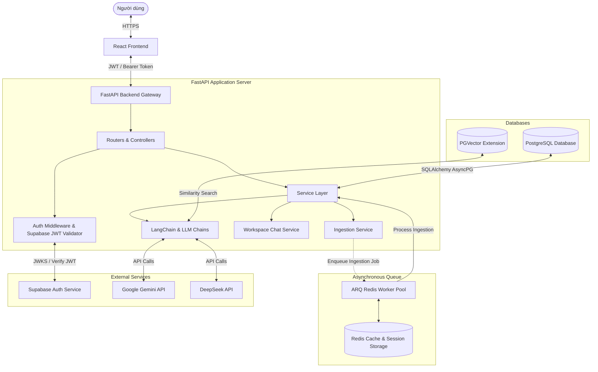
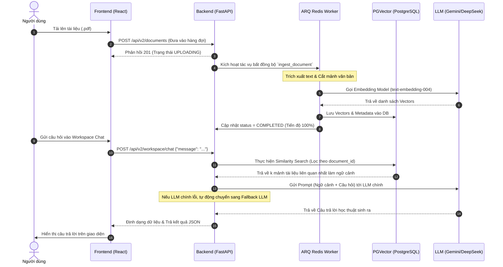
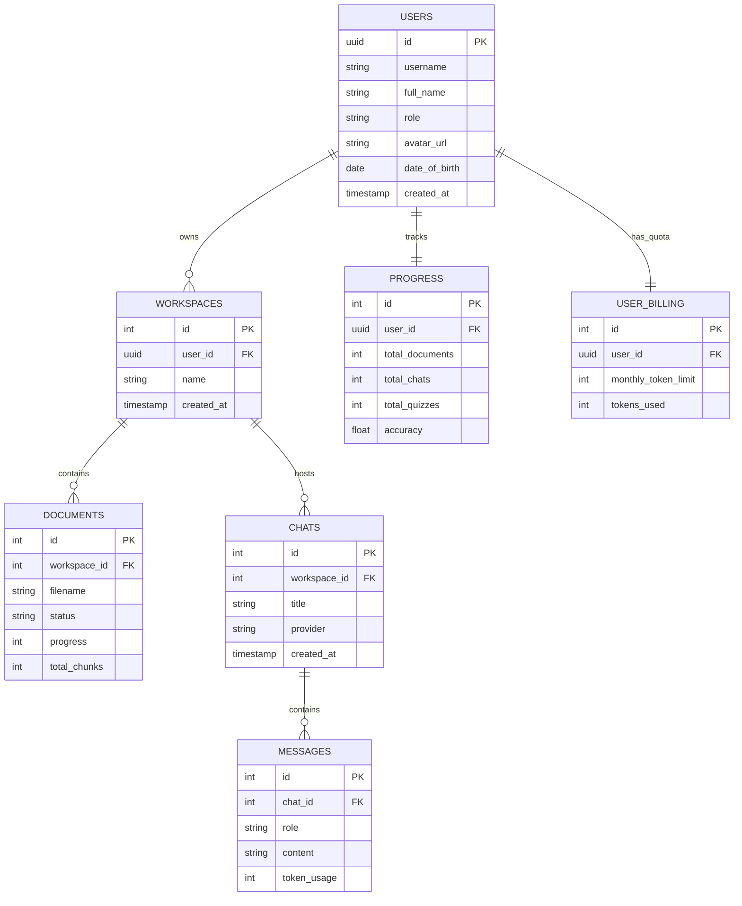
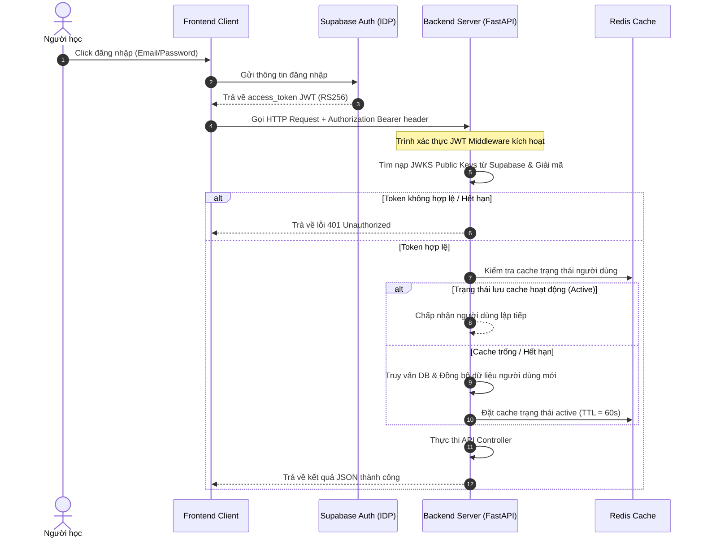

# CHƯƠNG 3: HIỆN THỰC HÓA HỆ THỐNG

Chương này trình bày chi tiết về quá trình hiện thực hóa hệ thống **AI Learning Assistant (LearnOS)**, bao gồm phân tích các thành phần dự án, kiến trúc tổng thể, cấu trúc thư mục source code, thiết kế chi tiết cơ sở dữ liệu (Database Schema), hiện thực hóa các chức năng cốt lõi (Backend & Frontend), tích hợp các dịch vụ Trí tuệ Nhân tạo (AI/RAG), cơ chế xác thực/phân quyền và kế hoạch kiểm thử hệ thống.

---

## 3.1 Phân tích các thành phần dự án

Dựa trên kết quả khảo sát toàn bộ mã nguồn hiện tại của hệ thống, các thành phần kỹ thuật được phân loại và triển khai cụ thể theo bảng dưới đây:

### Bảng 3.1: Bảng tổng hợp các thành phần dự án trong mã nguồn

| Thành phần | Mô tả chi tiết | File/Thư mục triển khai chính |
| :--- | :--- | :--- |
| **Frontend** | React (TypeScript), Bundler Vite, quản lý giao diện Responsive với CSS Tailwind. | [frontend/](../frontend) |
| **Backend** | API hiệu năng cao dựa trên ASGI Framework FastAPI (Python). | [backend/app/](../backend/app) |
| **Database (SQL)** | Hệ quản trị cơ sở dữ liệu quan hệ PostgreSQL với các bảng quản lý người dùng, workspace, chat, tài liệu, và tiến trình học tập. | [backend/app/database/session.py](../backend/app/database/session.py) |
| **Authentication** | Xác thực JWT phi tập trung, sử dụng dịch vụ của Supabase Auth làm Identity Provider chính. | [backend/app/dependencies/auth.py](../backend/app/dependencies/auth.py) |
| **Authorization** | Kiểm tra quyền hạn theo vai trò (Role-Based Access Control - RBAC) như `student`, `admin` thông qua FastAPI dependency. | [backend/app/dependencies/auth.py](../backend/app/dependencies/auth.py#L126-L131) |
| **AI Services** | Tích hợp Google Gemini (Gemini 2.0/1.5) và DeepSeek (via OpenAI Compatible API) để thực hiện hội thoại, sinh mindmap, quiz, giải thích thuật ngữ. | [backend/app/services/ai/](../backend/app/services/ai/) |
| **API Endpoints** | Các router định nghĩa RESTful APIs cho Auth, Documents, Users, Progress, Workspaces, Roadmaps, Analysis, Admin, và AI V2. | [backend/app/routers/](../backend/app/routers/) <br> [backend/app/api/routes/](../backend/app/api/routes/) |
| **Vector Database** | Mở rộng **PGVector** của PostgreSQL dùng để lưu trữ và truy vấn tương đồng (Cosine Similarity Search) với chỉ mục HNSW phục vụ RAG. | [backend/app/database/vectorstore.py](../backend/app/database/vectorstore.py) |
| **Document Processing** | Trích xuất nội dung văn bản (PDF, DOCX, TXT, MD) và phân mảnh văn bản (Text Chunking) tự động. | [backend/app/utils/text_extractor.py](../backend/app/utils/text_extractor.py) <br> [backend/app/utils/text_splitter.py](../backend/app/utils/text_splitter.py) |
| **Real-time Features** | Streaming Live Analytics thông qua Server-Sent Events (SSE) có xác thực mã token SSE tạm thời. | [backend/app/routers/admin.py](../backend/app/routers/admin.py#L234-L265) |
| **Admin Dashboard** | Giao diện quản trị viên quản lý danh sách người dùng, xem log hệ thống, giám sát ngân sách Token và xem thống kê lỗi. | [frontend/src/admin/](../frontend/src/admin/) <br> [backend/app/routers/admin.py](../backend/app/routers/admin.py) |
| **Logging** | Ghi nhận hoạt động hệ thống (System & Application logs) bằng thư viện `logging` chuẩn của Python và log lỗi hệ thống vào DB. | [backend/app/core/logging.py](../backend/app/core/logging.py) <br> [backend/app/models/billing.py](../backend/app/models/billing.py#L64-L79) |
| **Monitoring** | Kiểm tra trạng thái hệ thống qua endpoint `/health` và ghi nhận lịch sử tiêu thụ Token theo từng mô hình và nhà cung cấp. | [backend/app/main.py](../backend/app/main.py#L148-L150) <br> [backend/app/repositories/usage_repository.py](../backend/app/repositories/usage_repository.py) |
| **Testing** | Kiểm thử tự động bao gồm Unit Tests, Integration Tests, E2E Tests sử dụng thư viện `pytest`. | [backend/tests/](../backend/tests/) |
| **Payment System** | *Không tìm thấy trong source code hiện tại.* | - |

---

## 3.2 Kiến trúc tổng thể hệ thống và Luồng dữ liệu

Hệ thống được thiết kế theo mô hình kiến trúc Client-Server hiện đại, phân tách rõ ràng giữa giao diện hiển thị (Frontend) và logic nghiệp vụ (Backend), kết hợp với Cơ chế Truy xuất Nguồn thông tin Tăng cường (Retrieval-Augmented Generation - RAG).

### 3.2.1 Sơ đồ kiến trúc tổng thể



### 3.2.2 Luồng dữ liệu nghiệp vụ (Data Flow)

#### 1. Luồng dữ liệu tương tác thông thường (Không RAG)
* **Bước 1**: Người dùng tương tác trên `React Frontend` (ví dụ: Xem hồ sơ cá nhân). Giao diện gửi HTTP Request kèm Supabase JWT token trong Header `Authorization: Bearer <token>`.
* **Bước 2**: `FastAPI Backend` chặn Request tại Auth Middleware để decode JWT thông qua khóa JWKS từ Supabase. Nếu hợp lệ, tự động ánh xạ thông tin người dùng từ bảng `users`.
* **Bước 3**: Request chuyển tiếp đến Router tương ứng, gọi `Service Layer` xử lý logic (ví dụ: lấy thông tin GPA).
* **Bước 4**: `Service Layer` gọi `SQLAlchemy AsyncSession` để thực hiện truy vấn thông tin trong `PostgreSQL`.
* **Bước 5**: Kết quả truy vấn từ Database được serialize theo Schema của Pydantic và trả về Frontend dưới định dạng JSON.

#### 2. Luồng dữ liệu xử lý RAG (Retrieval-Augmented Generation) khi Upload Tài liệu & Chat
* **Bước 1 (Upload tài liệu)**: Người dùng tải lên tài liệu học tập (`.pdf`, `.docx`, `.txt`, `.md`). FastAPI lưu file vào thư mục `/uploads` và gọi dịch vụ hàng đợi bất đồng bộ **ARQ (Redis Worker)**.
* **Bước 2 (Trích xuất & Cắt nhỏ)**: Worker chạy ngầm kích hoạt `IngestionService.process_document()`. Văn bản thô được trích xuất (qua `extract_text()`) và chia nhỏ (qua `chunk_text()`) với kích thước mảnh văn bản `INGESTION_CHUNK_SIZE=1500` ký tự và trùng lặp `INGESTION_CHUNK_OVERLAP=150` ký tự.
* **Bước 3 (Nhúng & Lưu vector)**: Mỗi phân đoạn văn bản được nhúng sang dạng vector số chiều thông qua mô hình nhúng `models/text-embedding-004` của Google Gemini API. Các vector này cùng thông tin siêu dữ liệu (Metadata) được chèn hàng loạt vào bảng `langchain_pg_embedding` của **PGVector**. Trạng thái tài liệu được cập nhật thành `COMPLETED`.
* **Bước 4 (Truy vấn & Phản hồi)**: Khi người dùng gửi câu hỏi trong chat workspace:
  1. `RetrievalService` thực hiện tìm kiếm tương đồng ngữ nghĩa (Cosine Similarity Search) trên PGVector, lọc theo ID tài liệu đang chọn để lấy ra $k$ mảnh liên quan nhất ($k=5$).
  2. Câu hỏi của người dùng và các mảnh ngữ cảnh (Context) trích xuất được đưa vào bộ dựng Prompt mẫu `QA_PROMPT`.
  3. Prompt hoàn chỉnh được gửi tới mô hình AI đã chọn (Gemini hoặc DeepSeek). Nếu mô hình chính lỗi, chuỗi liên kết LCEL tự động kích hoạt cơ chế dự phòng (`with_fallbacks`) gọi mô hình thay thế.
  4. Trả kết quả câu trả lời có cấu trúc về cho người dùng.



---

## 3.3 Phân tích cấu trúc thư mục dự án

Mã nguồn dự án được tổ chức theo chuẩn phát triển hiện đại, phân chia rõ ràng các module backend và frontend:

### 3.3.1 Cấu trúc thư mục Backend
```
backend/
├── app/                        # Thư mục ứng dụng FastAPI chính
│   ├── api/                    # Định nghĩa API Router và Route V2
│   │   └── routes/             # Chứa logic định tuyến nâng cao (e.g. ai.py)
│   ├── core/                   # Cấu hình hệ thống, ngoại lệ, bảo mật, logging
│   ├── database/               # Khởi tạo kết nối DB, Session và cấu hình Vectorstore
│   ├── dependencies/           # Các dependency của FastAPI (Auth, AI providers)
│   ├── models/                 # Chứa các Model ORM SQLAlchemy
│   ├── prompts/                # Mẫu Prompt dùng để gọi LLMs
│   ├── repositories/           # Tương tác truy vấn thô cơ sở dữ liệu
│   ├── routers/                # Các route API chính của ứng dụng
│   ├── schemas/                # Khai báo các mô hình Pydantic định dạng Input/Output
│   ├── services/               # Lớp dịch vụ chứa logic nghiệp vụ chính
│   ├── utils/                  # Tiện ích bổ trợ (trích xuất text, định dạng dữ liệu)
│   ├── workers/                # Định nghĩa tác vụ nền chạy bằng ARQ Redis
│   └── main.py                 # File entry point chạy ứng dụng backend
├── migrations/                 # Thư mục di cư cơ sở dữ liệu (Alembic Migrations)
└── tests/                      # Thư mục kiểm thử tự động (Unit, Integration, E2E)
```

### 3.3.2 Cấu trúc thư mục Frontend
```
frontend/
├── public/                     # Tài nguyên tĩnh công khai (hình ảnh, favicon)
├── src/                        # Thư mục mã nguồn React chính
│   ├── admin/                  # Module quản trị viên (Giao diện, Mock Data, Config)
│   ├── api/                    # API client kết nối backend
│   ├── assets/                 # CSS và ảnh cục bộ
│   ├── components/             # Các Component React dùng chung
│   ├── hooks/                  # Các Custom Hooks tiện ích (useAuth, v.v.)
│   ├── lib/                    # Cấu hình SDK ngoài (Supabase Client)
│   ├── pages/                  # Các trang màn hình chính (Dashboard, Auth, Workspace, Profile)
│   ├── styles/                 # Tệp định nghĩa kiểu hiển thị
│   ├── types/                  # Định nghĩa TypeScript interface
│   ├── utils/                  # Các hàm tiện ích dùng chung ở Client
│   ├── App.tsx                 # Quản lý định tuyến chính của Client
│   ├── index.css               # Tệp CSS toàn cục (Tailwind cấu hình)
│   └── main.tsx                # Khởi chạy ứng dụng React Client
```

---

## 3.4 Thiết kế cơ sở dữ liệu (Database Schema)

Hệ thống lưu trữ dữ liệu trên PostgreSQL với các bảng được định nghĩa chi tiết thông qua SQLAlchemy ORM. Dưới đây là thiết kế chi tiết của các bảng quan trọng nhất.

### 3.4.1 Thiết kế chi tiết các bảng cơ sở dữ liệu

#### 1. Bảng `users` (Quản lý người dùng)
Bảng này lưu trữ thông tin tài khoản người dùng được đồng bộ và trích xuất trực tiếp từ Supabase JWT claims khi đăng nhập lần đầu.

| Tên trường | Kiểu dữ liệu | Khóa | Thuộc tính | Ý nghĩa giải thích |
| :--- | :--- | :--- | :--- | :--- |
| **id** | `UUID` | **PK** | Unique, Not Null | Khóa chính dạng UUID khớp với ID của Supabase |
| **username** | `VARCHAR(100)` | | Unique, Index, Not Null | Tên đăng nhập được chuẩn hóa |
| **full_name** | `VARCHAR(200)` | | Default `""` | Họ và tên đầy đủ |
| **role** | `VARCHAR(50)` | | Default `"student"` | Vai trò của người dùng (`student`, `admin`) |
| **avatar_url** | `VARCHAR(500)` | | Nullable | Đường dẫn ảnh đại diện |
| **date_of_birth** | `DATE` | | Nullable | Ngày sinh của người dùng |
| **gender** | `VARCHAR(20)` | | Nullable | Giới tính |
| **phone_number** | `VARCHAR(20)` | | Nullable | Số điện thoại |
| **address** | `VARCHAR(255)` | | Nullable | Địa chỉ liên lạc |
| **major** | `VARCHAR(255)` | | Nullable | Chuyên ngành học |
| **faculty** | `VARCHAR(255)` | | Nullable | Khoa trực thuộc |
| **created_at** | `TIMESTAMP` | | Default `now()` | Thời gian tạo tài khoản |
| **updated_at** | `TIMESTAMP` | | Default `now()` | Thời gian cập nhật tài khoản |
| **deleted_at** | `TIMESTAMP` | | Nullable | Thời gian xóa tài khoản (Soft Delete) |

#### 2. Bảng `workspaces` (Không gian học tập)
Mỗi không gian làm việc thuộc sở hữu của một người dùng và chứa một tập hợp tài liệu độc lập.

| Tên trường | Kiểu dữ liệu | Khóa | Thuộc tính | Ý nghĩa giải thích |
| :--- | :--- | :--- | :--- | :--- |
| **id** | `INTEGER` | **PK** | Auto Incremental | Mã định danh không gian làm việc |
| **user_id** | `UUID` | **FK** | Index, Not Null | Tham chiếu tới bảng `users(id)` |
| **name** | `VARCHAR(255)` | | Not Null | Tên của workspace |
| **created_at** | `TIMESTAMP` | | Default `now()` | Thời gian tạo |
| **deleted_at** | `TIMESTAMP` | | Nullable | Thời gian xóa (Soft Delete) |

#### 3. Bảng `documents` (Tài liệu học tập)
Quản lý siêu dữ liệu của tệp tin được tải lên và tiến trình thực hiện nhúng (Embedding) tài liệu sang Vectorstore.

| Tên trường | Kiểu dữ liệu | Khóa | Thuộc tính | Ý nghĩa giải thích |
| :--- | :--- | :--- | :--- | :--- |
| **id** | `INTEGER` | **PK** | Auto Incremental | Mã định danh tài liệu |
| **workspace_id** | `INTEGER` | **FK** | Index, Not Null | Tham chiếu tới bảng `workspaces(id)` |
| **filename** | `VARCHAR(255)` | | Not Null | Tên file gốc tải lên |
| **title** | `VARCHAR(255)` | | Nullable | Tiêu đề của tài liệu |
| **file_path** | `VARCHAR(512)` | | Nullable | Đường dẫn lưu trữ vật lý trên server |
| **file_size** | `INTEGER` | | Default `0` | Kích thước file (bytes) |
| **file_type** | `VARCHAR(20)` | | Nullable | Đuôi định dạng file (`pdf`, `docx`, `txt`, `md`) |
| **file_hash** | `VARCHAR(64)` | | Index, Nullable | Mã hash MD5/SHA256 tránh xử lý trùng lặp file |
| **status** | `VARCHAR(50)` | | Default `"UPLOADING"` | Trạng thái xử lý (`UPLOADING`, `EXTRACTING`, `COMPLETED`, `FAILED`) |
| **progress** | `INTEGER` | | Default `0` | Tiến độ xử lý phần trăm (0 - 100) |
| **chunks_count** | `INTEGER` | | Default `0` | Số mảnh văn bản đã nhúng thành công |
| **total_chunks** | `INTEGER` | | Default `0` | Tổng số mảnh văn bản được cắt ra |
| **embedding_batches**| `INTEGER` | | Default `0` | Số lô (batch) nhúng gửi đi |
| **error_message** | `TEXT` | | Nullable | Thông báo lỗi nếu thất bại |
| **metadata_json** | `JSON` | | Nullable | Các trường siêu dữ liệu động kèm theo |
| **created_at** | `TIMESTAMP` | | Default `now()` | Ngày tạo |
| **deleted_at** | `TIMESTAMP` | | Nullable | Thời gian xóa (Soft Delete) |

#### 4. Bảng `chats` & `messages` (Lịch sử hội thoại)
Bảng `chats` lưu trữ phiên hội thoại học tập, bảng `messages` lưu chi tiết các câu hỏi và câu trả lời trong phiên.

##### Bảng `chats`
| Tên trường | Kiểu dữ liệu | Khóa | Thuộc tính | Ý nghĩa giải thích |
| :--- | :--- | :--- | :--- | :--- |
| **id** | `INTEGER` | **PK** | Auto Incremental | Mã định danh phiên chat |
| **workspace_id** | `INTEGER` | **FK** | Index, Not Null | Tham chiếu tới bảng `workspaces(id)` |
| **title** | `VARCHAR(255)` | | Not Null | Tiêu đề phiên hội thoại |
| **provider** | `VARCHAR(50)` | | Not Null | Nhà cung cấp AI sử dụng (`gemini`, `deepseek`) |
| **created_at** | `TIMESTAMP` | | Default `now()` | Ngày tạo phiên |
| **completed_at** | `TIMESTAMP` | | Nullable | Thời điểm hoàn thành hội thoại |
| **deleted_at** | `TIMESTAMP` | | Nullable | Thời gian xóa (Soft Delete) |

##### Bảng `messages`
| Tên trường | Kiểu dữ liệu | Khóa | Thuộc tính | Ý nghĩa giải thích |
| :--- | :--- | :--- | :--- | :--- |
| **id** | `INTEGER` | **PK** | Auto Incremental | Mã định danh tin nhắn |
| **chat_id** | `INTEGER` | **FK** | Index, Not Null | Tham chiếu tới bảng `chats(id)` |
| **role** | `VARCHAR(20)` | | Not Null | Vai trò người gửi (`user`, `assistant`) |
| **content** | `TEXT` | | Not Null | Nội dung chi tiết tin nhắn văn bản |
| **token_usage** | `INTEGER` | | Default `0` | Số lượng tokens tiêu thụ cho tin nhắn này |
| **created_at** | `TIMESTAMP` | | Default `now()` | Thời gian tạo tin nhắn |
| **deleted_at** | `TIMESTAMP` | | Nullable | Thời gian xóa (Soft Delete) |

### 3.4.2 Sơ đồ ERD quan hệ dữ liệu (Entity-Relationship Diagram)

Mối quan hệ dữ liệu giữa các thực thể cốt lõi trong hệ thống được biểu diễn qua sơ đồ sau:



---

## 3.5 Hiện thực hóa các chức năng thực tế

### 3.5.1 Chức năng: Đăng nhập và lấy thông tin người dùng (/me)

* **Mục đích**: Nhận dạng thông tin phiên đăng nhập của người học và tự động đồng bộ (Auto-provision) hồ sơ của người học từ tài khoản quản lý của Supabase Auth sang cơ sở dữ liệu PostgreSQL cục bộ.
* **Luồng hoạt động**:
  1. Frontend React lấy mã JWT từ phiên làm việc Supabase và đính kèm vào header `Authorization: Bearer <JWT>`.
  2. Middleware `get_current_user` trong backend kiểm tra và giải mã mã JWT này qua JWKS.
  3. Nếu ID người dùng (`sub` claim) chưa tồn tại trong bảng `users`, hệ thống trích xuất Metadata của JWT (email, name) để tạo mới bản ghi người dùng với vai trò mặc định là `student`.
  4. Trả về thông tin người dùng cho Frontend.
* **File triển khai**:
  * [backend/app/routers/auth.py](../backend/app/routers/auth.py)
  * [backend/app/dependencies/auth.py](../backend/app/dependencies/auth.py)
* **API sử dụng**: `GET /api/v2/auth/me`
* **Database liên quan**: Bảng `users`
* **Minh họa mã nguồn thực tế**:
  Trích xuất từ [backend/app/dependencies/auth.py:L72-110](../backend/app/dependencies/auth.py#L72-L110):
  ```python
          # user is None — first-time login after Supabase Auth migration
          # Extract profile info from JWT claims (Supabase embeds these)
          email = payload.get("email", "")
          user_meta = payload.get("user_metadata", {}) or {}
          raw_user_meta = payload.get("raw_user_meta_data", {}) or {}
          all_meta = {**raw_user_meta, **user_meta}

          # Derive a username: prefer explicit username, fall back to email prefix
          username_base = (
              all_meta.get("username")
              or all_meta.get("name")
              or (email.split("@")[0] if email else None)
              or str(user_id)[:8]
          )
          # Sanitize: keep only alphanumeric + underscore, max 100 chars
          import re
          username_safe = re.sub(r"[^\w]", "_", username_base)[:100] or f"user_{str(user_id)[:8]}"

          full_name = (
              all_meta.get("full_name")
              or all_meta.get("name")
              or username_safe
          )

          try:
              user = User(
                  id=user_id,
                  username=username_safe,
                  full_name=full_name,
                  role="student",
              )
              db.add(user)
              await db.commit()
              await db.refresh(user)
              logger.info("Auto-provisioned new user record: id=%s username=%s", user_id, username_safe)
          except Exception as e:
              await db.rollback()
              logger.error("Failed to auto-provision user %s: %s", user_id, e)
              raise UnauthorizedError("Could not create user profile")
  ```

---

### 3.5.2 Chức năng: Đọc, Phân đoạn và Nhúng tài liệu (Document Ingestion)

* **Mục đích**: Tự động chuyển đổi tài liệu tải lên thành dữ liệu phân đoạn được đánh chỉ mục vector HNSW nhằm phục vụ cho hệ thống truy xuất dữ liệu thông tin sau này.
* **Luồng hoạt động**:
  1. FastAPI tiếp nhận file thông qua API POST `api/v2/documents/`, lưu tạm file vật lý và gọi hàng tác vụ ngầm chạy bất đồng bộ.
  2. `extract_text` phân tích và đọc văn bản của file PDF/DOCX/TXT/MD.
  3. `chunk_text` chia nhỏ nội dung thành các mảnh bằng nhau kích thước 1500 ký tự.
  4. Lớp dịch vụ chạy vòng lặp gửi các mảnh đi nhúng thông qua Gemini Embeddings và đẩy vào Vectorstore PGVector theo từng batch nhỏ (kích thước batch mặc định là 50).
* **File triển khai**:
  * [backend/app/services/ingestion/ingestion_service.py](../backend/app/services/ingestion/ingestion_service.py)
  * [backend/app/utils/text_extractor.py](../backend/app/utils/text_extractor.py)
* **API sử dụng**: `POST /api/v2/documents`
* **Database liên quan**: Bảng `documents`, `langchain_pg_embedding`
* **Minh họa mã nguồn thực tế**:
  Trích xuất từ [backend/app/services/ingestion/ingestion_service.py:L115-149](../backend/app/services/ingestion/ingestion_service.py#L115-L149):
  ```python
                  for batch_start in range(0, len(lc_documents), batch_size):
                      batch_index += 1
                      batch_docs = lc_documents[batch_start : batch_start + batch_size]
                      batch_texts = [doc.page_content for doc in batch_docs]
                      batch_metadatas = [doc.metadata for doc in batch_docs]
                      # Generate deterministic IDs for Upserting into PGVector
                      batch_ids = [f"doc_{document_id}_chunk_{doc.metadata['chunk_index']}" for doc in batch_docs]
                      
                      async with _embedding_semaphore:
                          batch_embeddings = await embeddings_model.aembed_documents(batch_texts)
                          # Incremental insert to prevent memory bloat and massive DB payloads
                          await vectorstore.aadd_embeddings(
                              batch_texts, 
                              batch_embeddings, 
                              metadatas=batch_metadatas, 
                              ids=batch_ids
                          )

                      stored_count += len(batch_texts)
                      progress = min(90, int((stored_count / len(lc_documents)) * 100))
                      status = (
                          DocumentStatus.PARTIAL_READY
                          if stored_count >= partial_threshold_chunks
                          else DocumentStatus.EMBEDDING
                      )

                      async with factory() as session:
                          res = await session.execute(select(Document).where(Document.id == document_id))
                          doc = res.scalar_one_or_none()
                          if doc:
                              doc.status = status
                              doc.progress = progress
                              doc.chunks_count = stored_count
                              doc.embedding_batches = batch_index
                              await session.commit()
  ```

---

### 3.5.3 Chức năng: Tạo Bản đồ tư duy thông minh (Mindmap Generator)

* **Mục đích**: Tự động tổng hợp tài liệu học tập hoặc các chủ đề được cung cấp để sinh ra cây bản đồ tư duy có cấu trúc phân tầng chi tiết.
* **Luồng hoạt động**:
  1. Người dùng yêu cầu tạo Mindmap trên một tài liệu cụ thể.
  2. Hệ thống lấy ra nội dung tài liệu đã lọc (`get_filtered_document_text`), giới hạn kích thước tối đa gửi lên mô hình là 6000 ký tự.
  3. Sử dụng hai chuỗi liên kết LCEL chạy tuần tự:
     * Chuỗi thứ nhất (`mindmap_outline`): Tạo dàn ý văn bản (Outline) thô mô tả cấu trúc của Mindmap từ nội dung ngữ cảnh tài liệu.
     * Chuỗi thứ hai (`mindmap_tree`): Tiếp nhận dàn ý ở trên, tiến hành sinh ra cây đối tượng có cấu trúc dạng JSON hợp lệ phân lớp từ Root, nhánh chính (Level 1), nhánh phụ (Level 2), và nút lá (Level 3-4), ràng buộc bởi cấu trúc của Pydantic Class `MindmapTree`.
  4. Trả về đối tượng cấu trúc cây JSON cho Frontend dựng lại sơ đồ Mindmap động trực quan.
* **File triển khai**:
  * [backend/app/services/mindmap_service.py](../backend/app/services/mindmap_service.py)
  * [backend/app/api/routes/ai.py](../backend/app/api/routes/ai.py#L161-L188)
* **API sử dụng**: `POST /api/v2/workspace/generate-mindmap`
* **Database liên quan**: Bảng `documents`
* **Minh họa mã nguồn thực tế**:
  Trích xuất từ [backend/app/services/mindmap_service.py:L26-53](../backend/app/services/mindmap_service.py#L26-L53):
  ```python
  async def generate_mindmap(
      topic: str,
      context: str,
      outline_chain: Runnable,
      tree_chain: Runnable,
  ) -> MindmapTree:
      """Sinh Mindmap Tree có kiểm soát cấu trúc qua 2 bước."""
      logger.info(f"Generating mindmap outline for topic: {topic}")
      try:
          # Bước 1: Sinh Outline dạng Text
          outline_text = await outline_chain.ainvoke({
              "topic": topic,
              "context": context
          })
          logger.info("Mindmap outline generated successfully. Building tree...")
          
          # Bước 2: Chuyển đổi Outline sang JSON Tree
          mindmap_tree = await tree_chain.ainvoke({
              "topic": topic,
              "outline": outline_text
          })
          logger.info(f"Mindmap tree structure created with {len(mindmap_tree.nodes)} nodes")
          return mindmap_tree
      except Exception as e:
          logger.exception("Failed to generate mindmap via LCEL chains")
          raise AppException(
              status_code=500,
              detail=f"Failed to generate mindmap: {str(e)}"
          )
  ```

---

## 3.6 Hiện thực hóa hệ thống AI & RAG Pipeline

Hệ thống AI nâng cấp (AI V2) được thiết kế xoay quanh kiến trúc chuỗi xử lý của **LangChain Expression Language (LCEL)**, liên kết chặt chẽ với cơ sở dữ liệu Vector mở mở rộng PGVector để hiện thực hóa kỹ thuật RAG.

### 3.6.1 Kiến trúc và Cấu hình Chuỗi AI (LLM Chains)
Hệ thống hỗ trợ 2 nhà cung cấp dịch vụ mô hình AI lớn: Google Gemini API (sử dụng gói thư viện `langchain_google_genai`) làm mô hình chủ chốt và DeepSeek (kết nối qua giao diện API tương thích của OpenAI - `ChatOpenAI`) làm phương án dự phòng.

* **LLM Factory**: Khởi tạo và thiết lập các tham số điều hướng LLM (nhiệt độ sáng tạo `temperature=0.0` để tối ưu hóa độ chính xác học thuật).
* **Cơ chế Dự phòng Native Fallbacks**: Khi một mô hình chính (ví dụ: Gemini) bị quá tải giới hạn Request (Rate Limit) hoặc gặp sự cố mạng, LangChain tự động kích hoạt chuỗi dự phòng thay thế đã cấu hình sẵn (`with_fallbacks`), đảm bảo hệ thống phản hồi thông suốt.

### 3.6.2 Xây dựng Chuỗi RAG đáp ứng câu hỏi (QA Chain)
Mã nguồn biểu diễn quy trình xử lý hội thoại dựa trên ngữ cảnh tài liệu tích hợp RAG:

Trích xuất từ [backend/app/services/ai/qa_chain.py:L6-27](../backend/app/services/ai/qa_chain.py#L6-L27):
```python
class QAChainBuilder:
    @staticmethod
    def build_chain(primary_llm, fallback_llms: list, retriever) -> Runnable:
        """
        Xây dựng RAG chain chuẩn LCEL với Native Fallback.
        Flow: question -> retrieve -> format context -> LLM (kèm fallback) -> Pydantic Output
        """
        # Áp dụng schema constraint cho primary và fallback
        structured_primary = primary_llm.with_structured_output(AnswerResponse, include_raw=True)
        structured_fallbacks = [llm.with_structured_output(AnswerResponse, include_raw=True) for llm in fallback_llms]
        
        # Tạo mô hình có fallback
        llm_with_fallback = structured_primary.with_fallbacks(structured_fallbacks)
        
        # Parallel processing: query context và đồng thời truyền message đi tiếp
        chain = (
            {"context": retriever | format_docs, "message": lambda x: x["message"]}
            | QA_PROMPT
            | llm_with_fallback
        )
        
        return chain
```

* **Xử lý song song (Parallel Processing)**: LangChain tiếp nhận đối tượng đầu vào, song song vừa lấy câu hỏi thô vừa đẩy câu hỏi vào bộ truy xuất dữ liệu `retriever` để tìm kiếm tương đồng trên PGVector, định dạng và đưa vào khuôn prompt `QA_PROMPT`.

---

## 3.7 Hiện thực hóa Xác thực và Phân quyền

Cơ chế an toàn bảo mật của ứng dụng được xây dựng dựa trên việc kết hợp dịch vụ ngoài **Supabase Auth** và quản lý mã khóa JWT nội bộ.

### 3.7.1 Quy trình Xác thực (Authentication Flow)



### 3.7.2 Phân quyền Người dùng (Role-Based Access Control - RBAC)
Lớp bảo vệ quyền lợi người dùng được thực thi qua hàm Dependency `require_role` để giới hạn các thao tác đặc thù (chỉ admin mới có quyền truy cập thông tin bảng điều khiển tổng).

Trích xuất từ [backend/app/dependencies/auth.py:L126-131](../backend/app/dependencies/auth.py#L126-L131):
```python
def require_role(allowed_roles: List[str]) -> Callable:
    async def role_checker(current_user: User = Depends(get_current_user)) -> User:
        if current_user.role not in allowed_roles:
            raise UnauthorizedError(f"Operation requires one of roles: {allowed_roles}")
        return current_user
    return role_checker
```

---

## 3.8 Định nghĩa chi diện lập trình ứng dụng (API Endpoints)

Hệ thống cung cấp hệ thống API đa dạng để xử lý tất cả các tương tác nghiệp vụ từ client.

### Bảng 3.2: Danh sách các API Endpoints chi tiết trong hệ thống

| Nhóm chức năng | Phương thức | Endpoint | Mô tả nghiệp vụ |
| :--- | :--- | :--- | :--- |
| **Auth** | `GET` | `/api/v2/auth/me` | Lấy hồ sơ thông tin người dùng đang đăng nhập. |
| **Workspaces** | `GET` | `/api/v2/workspaces/` | Liệt kê danh sách các không gian làm việc của người dùng. |
| | `POST` | `/api/v2/workspaces/` | Tạo không gian làm việc mới. |
| | `GET` | `/api/v2/workspaces/{workspace_id}` | Xem chi tiết thông tin không gian làm việc. |
| | `DELETE` | `/api/v2/workspaces/{workspace_id}` | Xóa không gian làm việc (Soft Delete). |
| **Documents** | `POST` | `/api/v2/documents/` | Upload tệp tài liệu và chạy luồng nhúng nền ngầm. |
| | `GET` | `/api/v2/documents/` | Liệt kê tất cả tài liệu kèm trạng thái xử lý trong Workspace. |
| | `GET` | `/api/v2/documents/{doc_id}` | Xem chi tiết tài liệu học tập. |
| | `GET` | `/api/v2/documents/{doc_id}/status` | Theo dõi tiến độ phần trăm xử lý nhúng tài liệu. |
| | `DELETE` | `/api/v2/documents/{doc_id}` | Xóa tài liệu khỏi Workspace. |
| **AI V2** | `POST` | `/api/v2/workspace/chat` | Đặt câu hỏi trong workspace (hỗ trợ RAG). |
| | `GET` | `/api/v2/workspace/chat/history` | Lấy lịch sử đoạn chat của workspace hiện tại. |
| | `POST` | `/api/v2/workspace/summarize` | Gọi AI tóm tắt nội dung tài liệu đơn lẻ. |
| | `POST` | `/api/v2/workspace/summarize-multiple` | Tổng hợp tóm tắt nhiều tài liệu học tập cùng một lúc. |
| | `POST` | `/api/v2/workspace/generate-quiz` | Tự động thiết lập và sinh Quiz câu hỏi trắc nghiệm từ tài liệu. |
| | `POST` | `/api/v2/workspace/generate-mindmap` | Tạo sơ đồ bản đồ tư duy JSON Tree từ tài liệu. |
| | `POST` | `/api/v2/workspace/explain` | Giải thích sâu ngữ nghĩa của một phân đoạn text từ tài liệu. |
| | `POST` | `/api/v2/workspace/grade` | Đánh giá, chấm điểm kết quả bài thi trắc nghiệm của người học. |
| **Roadmaps** | `POST` | `/api/v2/roadmap/generate` | Sinh lộ trình học tập cá nhân hóa. |
| | `GET` | `/api/v2/roadmap/timeline/list` | Danh sách lộ trình học tập dạng dòng thời gian. |
| **Admin** | `GET` | `/api/v2/admin/users` | Quản lý, hiển thị phân trang danh sách người dùng hệ thống. |
| | `GET` | `/api/v2/admin/dashboard-stats` | Thống kê số lượng người dùng, yêu cầu AI hàng ngày, tỉ lệ lỗi. |
| | `GET` | `/api/v2/admin/analytics/overview` | Xem dữ liệu biểu đồ chi tiết tiêu thụ token, độ tăng trưởng người dùng. |
| | `GET` | `/api/v2/admin/analytics/overview/stream` | Cập nhật trực tiếp số liệu thống kê qua Server-Sent Events (SSE). |

---

## 3.9 Hiện thực hóa giao diện Người dùng (Frontend Implementation)

Giao diện người dùng được xây dựng hoàn toàn bằng React (TypeScript) định dạng chia nhỏ linh hoạt các trang hiển thị.

* **Định tuyến (Routing)**: Quản lý tập trung tại [frontend/src/App.tsx](../frontend/src/App.tsx) sử dụng thư viện `react-router-dom`. Các màn hình như `UserProfilePage`, `WorkspacePage`, `DashboardPage` được áp dụng giải pháp trì hoãn tải (Lazy Loading) thông qua `React.lazy` kết hợp `Suspense` giúp cải thiện đáng kể tốc độ phản hồi kết xuất ban đầu của trình duyệt.
* **Bảo vệ tuyến đường (Protected Route)**: Lọc trạng thái đăng nhập, điều phối tự động người học về trang `AuthPage` nếu phiên làm việc hết hạn hoặc chuyển admin sang giao diện `AdminApp` quản lý riêng.
* **Quản lý trạng thái và Kết nối API**: Giao tiếp trực tiếp với backend FastAPI qua Axios client thiết lập sẵn mã Authorization Bearer JWT.

---

## 3.10 Kiểm thử hệ thống (System Testing)

Dự án áp dụng khung kiểm thử tự động toàn diện tích hợp bộ công cụ kiểm thử hiệu năng cao `pytest` của Python, chia nhỏ thành các cấp độ kiểm thử khác nhau:

* **Unit Tests (Kiểm thử đơn vị)**:
  * Kiểm tra tính đúng đắn của việc giải mã khóa JWT (`test_jwt.py`), xử lý cấu hình CORS (`test_cors.py`), kiểm tra giới hạn Rate Limit (`test_rate_limit.py`).
  * Đo lường logic sinh trắc nghiệm (`test_quiz_service.py`) và thuật toán tạo bản đồ tư duy (`test_mindmap_service.py`).
* **Integration Tests (Kiểm thử tích hợp)**:
  * Kiểm thử toàn trình luồng nạp tài liệu từ đầu đến cuối (`test_ingestion.py`), tích hợp lưu trữ tệp vật lý (`test_storage_service.py`) và liên kết kiểm thử Soft Delete trên dữ liệu ORM (`test_soft_delete_architecture.py`).
* **E2E Tests (Kiểm thử luồng hệ thống)**:
  * Mô phỏng giả lập kịch bản người dùng tương tác trọn vẹn từ bước đăng nhập, tạo không gian làm việc, tải tài liệu, thực hiện chat hỏi đáp RAG, và kiểm thử bảo mật nâng cao trong thư mục `tests/e2e`.

---
*Báo cáo khoa học được tổng hợp và phân tích trực tiếp dựa trên mã nguồn thực tế của dự án AI Learning Assistant.*
