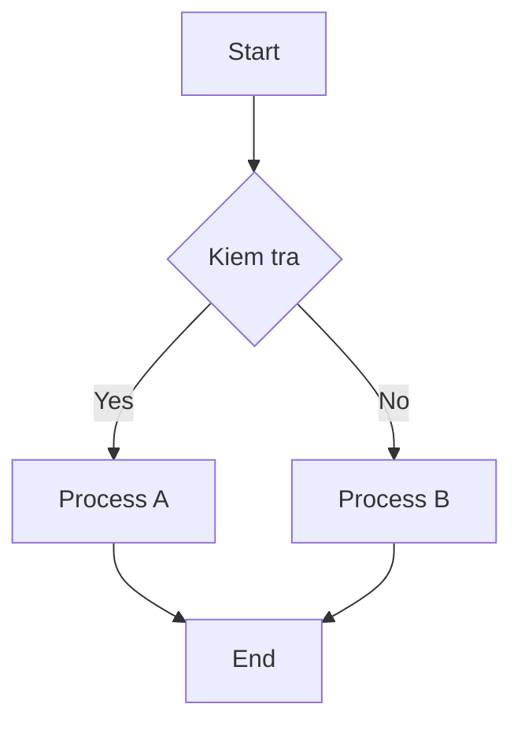
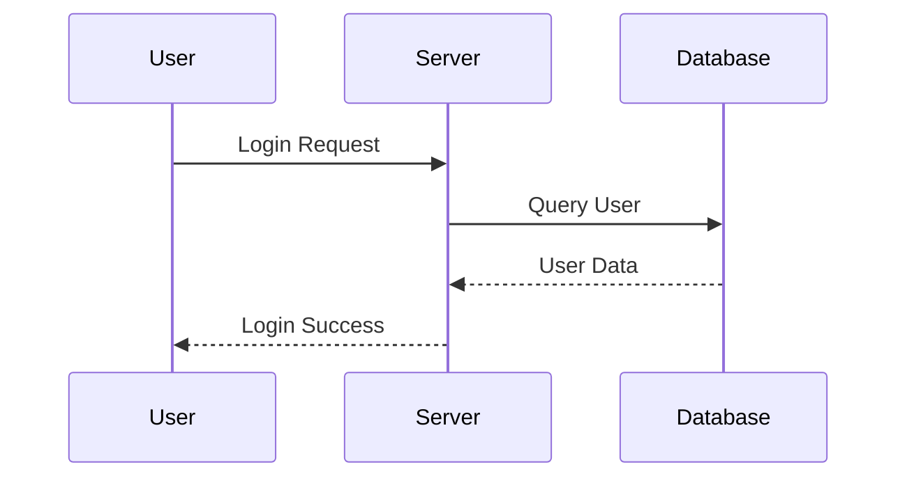
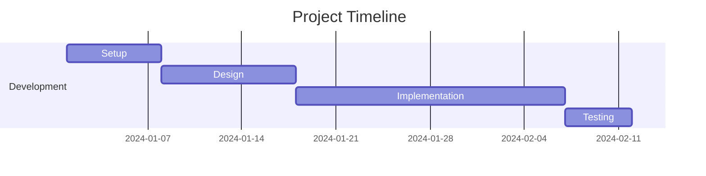
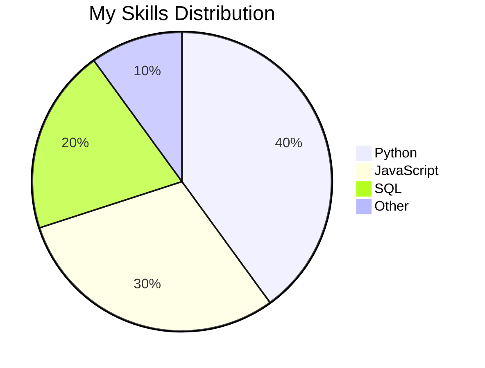
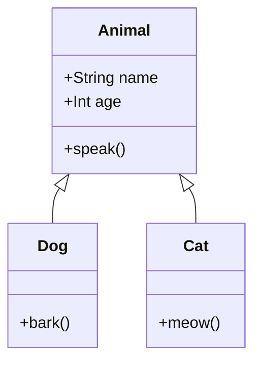
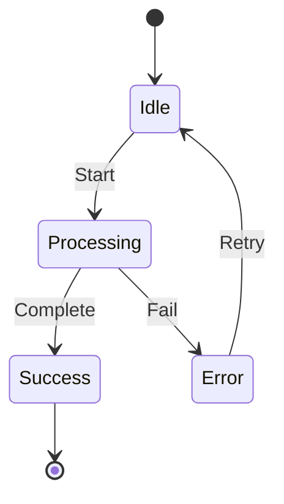

# Huong Dan Su Dung Mermaid Diagrams

## Gioi thieu

Mermaid la ngon ngu de ve diagram bang code. Khi chuyen sang Word, cac diagram nay se duoc render thanh hinh anh neu may co `mmdc` hoac co ket noi internet.

---

## 1. Flowchart



## 2. Sequence Diagram



## 3. Gantt Chart



## 4. Pie Chart



## 5. Class Diagram



## 6. State Diagram



## Luu y

- Can ket noi internet de render diagram bang Mermaid Ink neu chua cai Mermaid CLI.
- Neu khong render duoc, cong cu se nhung source Mermaid vao Word.
- Ho tro flowchart, sequence, gantt, pie, class, state va cac loai Mermaid pho bien khac.

## Cach Su Dung

Viet ma Mermaid trong khoi code:

````markdown

````

Chay convert:

```bash
python agi.py md2word samples/mermaid_sample.md
```
